# DashTab — System Architecture

**Rubric:** FS-1  
**Date:** 2026-06-14  
**Format:** Mermaid flowchart (renders on GitHub) + component decisions table

---

## Component Diagram

```mermaid
flowchart TD
    %% ── Clients ────────────────────────────────────────────────────────────────
    subgraph CLIENTS["👤 Clients"]
        direction LR
        Browser["Restaurant staff\n(browser / desktop)"]
        Diner["Diner / guest\n(mobile browser)"]
        MCPClient["AI agent\n(Claude / MCP client)"]
    end

    %% ── Frontend ───────────────────────────────────────────────────────────────
    subgraph FRONTEND["⚡ Frontend — Next.js 15 / React 19 (App Router)"]
        direction TB
        Marketing["(marketing) route group\nLanding · Pricing · About · Contact"]
        Auth["(auth) route group\nLogin · Register"]
        Dashboard["(dashboard) route group\nKPI · Orders · Menu · KDS · Staff\nSchedule · Overview · Reports · Settings"]
        PublicPage["r/[restaurantId] route\nAI Recommendation page\n(no auth required)"]
        Subscribe["subscribe/ route\nStripe checkout flow"]

        TanStack["TanStack React Query\n(server-state cache)"]
        Zustand["Zustand\n(client UI state)"]
        PostHog["PostHog JS\n(analytics · A/B test · NSM)"]
        SignalRClient["@microsoft/signalr\n(KDS real-time)"]
    end

    %% ── Auth ────────────────────────────────────────────────────────────────────
    subgraph IDENTITY["🔑 Identity — Keycloak"]
        KC["Keycloak\nJWT issuer · RBAC\nGoogle OAuth2 SSO\nmulti-tenant realm"]
    end

    %% ── Backend ─────────────────────────────────────────────────────────────────
    subgraph BACKEND[".NET 10 Backend — Clean Architecture"]
        direction TB
        subgraph API["DashTab.API"]
            Controllers["REST Controllers\n(auth · menu · orders · staff\n· schedule · analytics · public)"]
            Middleware["Middleware\nRestaurantContextMiddleware\nRateLimiter · ExceptionHandler"]
            SignalRHub["OrderHub (SignalR)\nKDS real-time bridge"]
            MCPServer["MCP Server (in-process)\nMenuTools · OrderTools · StaffTools"]
            Hangfire["Hangfire Dashboard\n+ Job Processor"]
        end
        subgraph APP["DashTab.Application"]
            Services["Application Services\n(CQRS-lite, no MediatR)"]
            Interfaces["Interfaces\nIRecommendationService\nIStorageService · IFeatureFlags…"]
            Validators["FluentValidation\nrequest validators"]
            Mappers["Mapperly\nsource-gen mappers"]
        end
        subgraph DOMAIN["DashTab.Domain"]
            Entities["Entities\nRestaurant · User · MenuItem\nOrder · OrderItem · Subscription\nWorkShift · ShiftRequest · AuditLog"]
            Enums["Enums\nRole · OrderStatus · Plan\nSubscriptionStatus · ShiftRequest*"]
        end
        subgraph INFRA["DashTab.Infrastructure"]
            EFCore["EF Core 9\nDashTabDbContext\nSoft-delete · Audit trail\nGlobal query filters"]
            RecoSvc["RecommendationService\nEmbed → pgvector → LLM blurb"]
            StorageSvc["StorageService\nMinIO presigned URLs"]
            FFSvc["UnleashFeatureFlags\n(NullFeatureFlags in local dev)"]
            Serilog["Serilog\nCorrelation IDs → Loki + Elasticsearch"]
        end
    end

    %% ── Data ────────────────────────────────────────────────────────────────────
    subgraph DATA["💾 Data & Messaging"]
        Postgres[("PostgreSQL 16\n+ pgvector extension\nHNSW cosine index on\nMenuItem.Embedding")]
        Redis[("Redis 7\nDistributed cache\nSignalR backplane")]
        RabbitMQ[("RabbitMQ\nEvent bus\n(order events)")]
        MinIO[("MinIO\nObject storage\nmenu item images)")]
    end

    %% ── External ────────────────────────────────────────────────────────────────
    subgraph EXTERNAL["🌐 External Services"]
        OpenAI["OpenAI API\ntext-embedding-3-small\ngpt-4o-mini"]
        Stripe["Stripe\nSubscription plans\nCheckout · Webhooks"]
        Unleash["Unleash Cloud EU\nFeature flags\n(menu-recommendations gate)"]
    end

    %% ── Observability ───────────────────────────────────────────────────────────
    subgraph OBS["📊 Observability"]
        Prometheus["Prometheus\n+ Alertmanager"]
        Grafana["Grafana\nAPI + infra dashboards"]
        Loki["Loki + Promtail\nlog aggregation"]
        ELK["ELK Stack\nElasticsearch · Logstash · Kibana\n(structured log search)"]
        UptimeKuma["Uptime Kuma\nBlack-box uptime\nPublic status page"]
        AIOps["AIOps triage service\nFlask — Alertmanager\n→ LLM → Slack"]
    end

    %% ── DevOps ──────────────────────────────────────────────────────────────────
    subgraph DEVOPS["🚀 DevOps"]
        GHA["GitHub Actions\nci.yml · cd.yml · codeql.yml\ndast.yml · secret-scan.yml\nrelease.yml"]
        Docker["Docker Compose\n(local: backend · observability\n· elk · automation profiles)"]
        Helm["Helm (15 charts)\nproject-05 AKS namespace\n(backend · frontend · keycloak\n· postgres · redis · rabbitmq\n· minio · loki · prometheus\n· grafana · uptime-kuma\n· elasticsearch · kibana\n· aiops-triage · db-backup)"]
        KeyVault["Azure Key Vault\nDeploy-time secrets injection\n(OpenAI · Stripe · Redis\n· Keycloak · Unleash · Storage)"]
    end

    %% ── Flows ───────────────────────────────────────────────────────────────────

    %% Client → Frontend
    Browser -->|"HTTPS"| Marketing
    Browser -->|"HTTPS"| Auth
    Browser -->|"HTTPS (httpOnly cookie)"| Dashboard
    Diner   -->|"HTTPS (no auth)"| PublicPage
    Browser -->|"HTTPS"| Subscribe

    %% Frontend → Auth
    Auth -->|"POST /auth/login\nSet-Cookie: access_token (httpOnly)"| KC

    %% Frontend → Backend (authenticated)
    Dashboard -->|"credentials:include\n(httpOnly JWT cookie)"| Controllers
    Dashboard -->|"WebSocket (SignalR)"| SignalRHub

    %% Frontend → External
    Subscribe -->|"redirect to hosted checkout"| Stripe
    Dashboard -->|"posthog.capture()\ngroup() identify"| PostHog
    PublicPage -->|"fetch /api/v1/public/recommend\n(no credentials)"| Controllers

    %% Frontend → Unleash
    PublicPage -->|"isFeatureEnabled()\nISR 30s"| Unleash

    %% MCP Client
    MCPClient -->|"MCP protocol"| MCPServer

    %% Backend internal
    Controllers --> Middleware
    Middleware --> Services
    Services --> Interfaces
    Interfaces --> EFCore
    Interfaces --> RecoSvc
    Interfaces --> StorageSvc
    Interfaces --> FFSvc
    Services --> Validators
    Services --> Mappers

    %% Backend → Identity
    Middleware -->|"introspect JWT\n/ JWKS"| KC

    %% Backend → Data
    EFCore -->|"Npgsql + pgvector"| Postgres
    EFCore -->|"StackExchange.Redis\ncache-aside pattern"| Redis
    SignalRHub -->|"Redis backplane\nhorizontal scale"| Redis
    Services -->|"publish order events"| RabbitMQ
    StorageSvc -->|"presigned URLs\ndirect upload/download"| MinIO
    Hangfire -->|"job persistence"| Postgres

    %% Backend → External
    RecoSvc -->|"POST /embeddings\nPOST /chat/completions"| OpenAI
    Controllers -->|"Stripe SDK\ncheckout · webhooks"| Stripe
    FFSvc -->|"poll feature flags"| Unleash

    %% Observability wiring
    Serilog -->|"structured logs"| Loki
    Serilog -->|"structured logs"| ELK
    Controllers -->|"metrics scrape"| Prometheus
    Prometheus -->|"alert rules"| AIOps
    Prometheus --> Grafana
    Loki --> Grafana
    AIOps -->|"LLM → Slack"| EXTERNAL

    %% DevOps wiring
    GHA -->|"build + test + scan\n(Trivy · gitleaks · ZAP · CodeQL)"| BACKEND
    GHA -->|"helm upgrade"| Helm
    KeyVault -->|"secrets at deploy-time"| GHA
    Helm -->|"K8s manifests"| DATA
    Helm -->|"K8s manifests"| OBS
    UptimeKuma -->|"HTTP probes\n6 monitors"| BACKEND
```



---

## Component Decision Log

| Component | Choice | Alternative considered | Decision rationale |
|---|---|---|---|
| **Frontend framework** | Next.js 15 App Router | Vite + React SPA | SSR for SEO (marketing + AI recommendation page); route groups cleanly separate marketing / auth / dashboard without shared layout bleed |
| **Auth storage** | httpOnly cookies (`SameSite=Strict`) | `localStorage` tokens | httpOnly cookies are XSS-resistant — JavaScript cannot read them. `SameSite=Strict` mitigates CSRF on a single-origin SPA without a separate CSRF token. |
| **Backend architecture** | .NET 10 Clean Architecture (4 layers) | Minimal API + single project | Domain isolation enforces that business rules cannot import infrastructure (EF Core, HTTP clients); the layer boundary is the enforcement mechanism, not a coding convention. |
| **ORM** | EF Core 9 + Npgsql | Dapper | EF Core's global query filters enforce multi-tenant isolation and soft-delete at the ORM layer — misuse is a compile-time error, not a forgotten `WHERE`. |
| **Vector store** | pgvector (Postgres extension) | Pinecone / Weaviate (separate service) | One fewer operational component; the vector column lives in the same DB as the menu data, simplifying transactions and backup/restore. Cosine ANN search via HNSW index is fast enough for per-restaurant menu sizes (<10k rows). |
| **Redis role** | Distributed cache **+** SignalR backplane | Cache-only (no backplane) | Using Redis as the SignalR backplane means OrderHub messages fan out across multiple backend pods without sticky sessions — horizontal scale of the KDS is free. |
| **Object storage** | MinIO (self-hosted S3-compatible) | AWS S3 | Self-hosted keeps all data in-cluster; S3-compatible API means zero code change if migrated to S3 later. Presigned URLs let clients upload/download directly without proxying through the backend. |
| **Identity** | Keycloak (self-hosted) | Auth0 / Supabase Auth | Keycloak supports Google OAuth2 SSO, custom RBAC roles, and multi-tenant realm configuration. Self-hosted avoids per-MAU pricing and keeps PII on-cluster. |
| **Message bus** | RabbitMQ | Azure Service Bus / Kafka | RabbitMQ runs in Docker/Helm alongside the rest of the stack; no cloud dependency. Sufficient for our event volume (order placed → email). |
| **Log aggregation** | Serilog → Loki/Grafana (primary) + ELK (full-text search) | Single stack | Loki is lightweight and integrates into the same Grafana instance as Prometheus — one UI for logs + metrics. ELK is added for full-text structured-log search (Elasticsearch query DSL). |
| **Uptime monitoring** | Uptime Kuma | Pingdom / Better Uptime | Self-hosted, public status page, multi-channel alerts (Slack + email) at zero cost. Black-box HTTP probes complement Prometheus white-box metrics. |
| **AIOps** | Custom Flask service (Alertmanager webhook → LLM → Slack) | n8n / PagerDuty | Bespoke triage allows full control of the LLM prompt and routing logic; Flask matches the team's Python skills for the ML/analytics layer. |
| **Feature flags** | Unleash Cloud EU | LaunchDarkly / home-rolled | Unleash has a generous free tier, EU data residency, and a clean SDK for both .NET and Next.js server components. Fail-open `NullFeatureFlags` means local dev works without credentials. |
| **CI security gates** | Trivy (image scan) + gitleaks (secrets) + ZAP DAST + CodeQL + SBOM | Single tool | Each tool covers a distinct threat surface: Trivy = OS/dep CVEs in the final image; gitleaks = secrets in history; ZAP = runtime OWASP Top 10; CodeQL = source-level bugs; SBOM = supply chain inventory. |
| **Secret management** | Azure Key Vault (deploy-time injection) | GitHub Secrets | Key Vault is the authoritative secret store; GitHub Actions fetches + masks at deploy time with `--output none`. No secret is ever stored in git or CI environment variables at rest. |
| **Container orchestration** | Kubernetes via Helm (15 charts) for prod; Docker Compose for local | Docker Compose only | Helm enables per-environment value overrides (`values-project05.yaml`), declarative rollback, and health-gated deploys (`--atomic`). Compose remains for local dev speed. |

---

## Data flows (key paths)

### 1. Authenticated dashboard request
```
Browser → nginx (TLS termination) → Next.js → fetch with credentials:include
→ .NET API → RestaurantContextMiddleware (extract RestaurantId from JWT, set ambient tenant)
→ Application Service → EF Core (global filter: WHERE restaurant_id = @tenant)
→ PostgreSQL → response → browser
```

### 2. KDS real-time update
```
Waiter places order → POST /orders → OrderService.CreateAsync
→ SaveChangesAsync → OrderHub.NotifyOrderPlaced()
→ Redis backplane → SignalR → all KDS browser connections subscribed to this restaurant
```

### 3. AI menu recommendation (public, no auth)
```
Diner → GET /r/{restaurantId} → Next.js server component
→ isFeatureEnabled('menu-recommendations') [Unleash, ISR 30s] → flag on
→ render RecommendClient (CSR) → POST /api/v1/public/restaurants/{id}/recommend {"query":"..."}
→ PublicController → RecommendationService.RecommendAsync
  → EmbedTextAsync → OpenAI /embeddings (text-embedding-3-small)
  → pgvector: SELECT … ORDER BY embedding <=> @queryVec WHERE restaurant_id = @id LIMIT 5
  → GenerateBlurbAsync → OpenAI /chat/completions (gpt-4o-mini)
→ 200 {message, items} → render item cards + AI blurb
```

### 4. CD pipeline
```
git push → GitHub Actions ci.yml (lint · test · Trivy · gitleaks · ZAP · CodeQL)
→ ci-pass gate → cd.yml: az keyvault secret show (masked) → helm upgrade --atomic
→ Kubernetes rolling update → Prometheus scrape + Uptime Kuma probe confirm health
```
