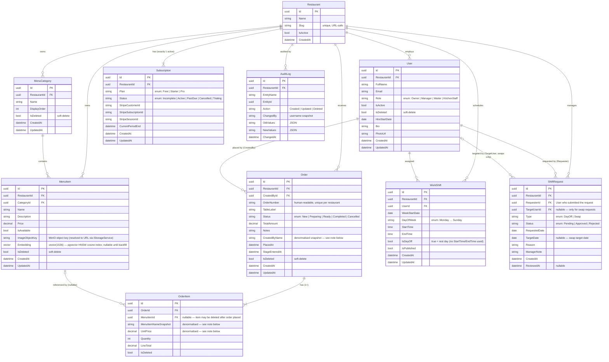

# Entity-Relationship Diagram — DashTab

**Rubric:** FS-3  
**Notation:** Crow's foot (Mermaid `erDiagram`)  
**Source:** EF Core domain entities in `src/backend/DashTab.Domain/Entities/`  
**Normal form:** 3NF throughout; one deliberate denormalisation noted below  
**Generated:** 2026-06-14 (auto-derived from entity source + annotated)

---

## Diagram

---

## Entity notes

### Denormalisation (intentional, 3NF exception)

`OrderItem` stores **`MenuItemNameSnapshot`** and **`UnitPrice`** as denormalised columns, and `Order` stores **`CreatedByName`**. These are **intentional** violations of strict 3NF:

- A `MenuItem` can be renamed or repriced, or soft-deleted, after an order is placed.
- An `Order` must remain an accurate historical record regardless of subsequent menu or staff changes.
- Without the snapshot, querying historical order totals would require joining to a point-in-time view that EF Core cannot express with a simple FK.

The FK `OrderItem.MenuItemId` is **nullable** for the same reason — if the item is deleted, the FK becomes null but the name and price snapshots remain.

### Soft-delete pattern

Every user-facing entity (`User`, `MenuCategory`, `MenuItem`, `Order`, `OrderItem`) has `IsDeleted bool`. A global EF Core query filter (`HasQueryFilter(e => !e.IsDeleted)`) applies to all queries by default. Hard deletes are never used; `RecommendationService` uses `IgnoreQueryFilters()` with explicit `IsDeleted = false` guards for the anonymous path.

### Multi-tenant isolation

Every table except `AuditLog` primary entities has a `RestaurantId` FK. The EF Core global filter enforces `WHERE restaurant_id = @currentTenantId` on every authenticated query. Anonymous endpoints (public recommendation) use `IgnoreQueryFilters()` + explicit `WHERE restaurant_id = @routeId` to enforce tenant scope without the ambient tenant context.

### pgvector extension (non-relational column)

`MenuItem.Embedding` is a `vector(1536)` Postgres column type provided by the `pgvector` extension. It stores the OpenAI `text-embedding-3-small` embedding for each menu item and is used for approximate nearest-neighbour cosine-similarity search (`ORDER BY embedding <=> @queryVec`). An **HNSW index** (`ix_menu_items_embedding_hnsw`) is created by migration for fast ANN queries. This column has **no relational FK** — it is a feature vector, not a reference.

---

## Migration strategy

DashTab uses **EF Core 9 code-first migrations** (`dotnet ef migrations add <Name>` / `dotnet ef database update`).

- Migrations live in `src/backend/DashTab.Infrastructure/Migrations/`.
- The app calls `Database.MigrateAsync()` on startup so every deploy applies pending migrations automatically.
- The Postgres `vector` extension is enabled by the initial migration via `migrationBuilder.Sql("CREATE EXTENSION IF NOT EXISTS vector;")` — this must run **before** the `vector(1536)` column migration.
- The HNSW index is created with plain `CREATE INDEX` (not `CONCURRENTLY`) because EF Core wraps migrations in a transaction block and Postgres prohibits `CREATE INDEX CONCURRENTLY` inside a transaction. See `docs/ai-debug-session-hnsw-migration.md` for the incident where this was discovered.
- Reference: `docs/migrations.md` for the full migration history and naming conventions.
